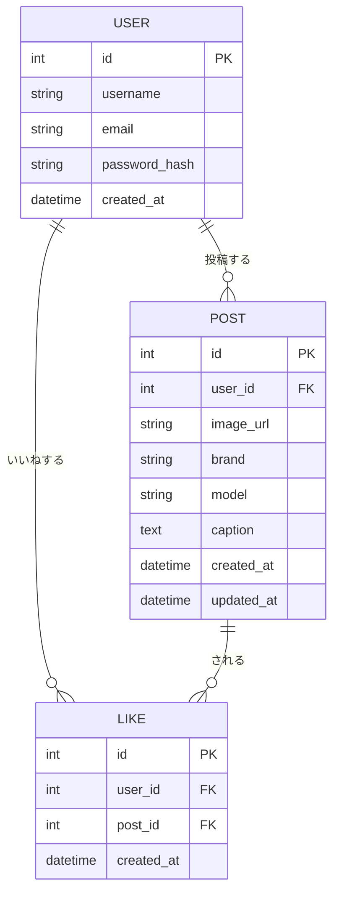
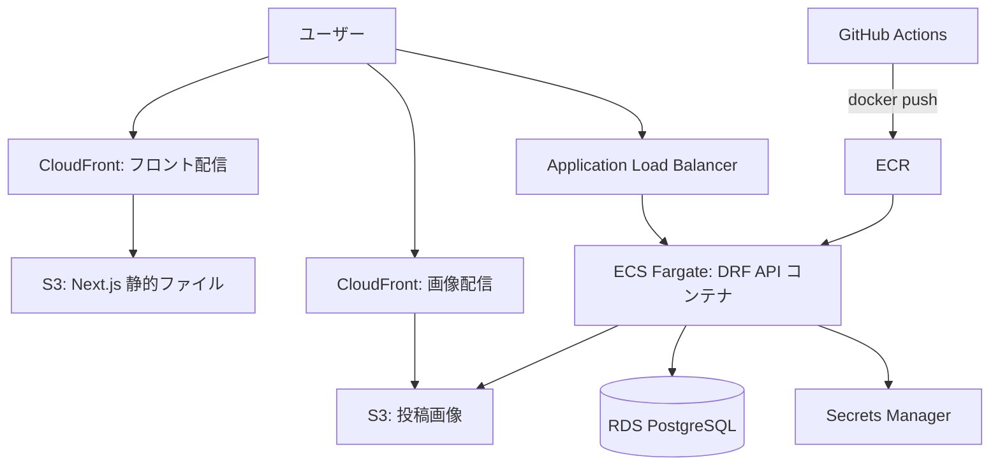

# Patina Gallery — アプリケーション仕様書

## 1. プロジェクト概要

### 1.1 目的

ブーツの写真を投稿・共有し、経年変化(Patina)を楽しむWebアプリケーションのようなSNS。
本プロジェクトは **バックエンドエンジニアへの転職ポートフォリオ** を主目的とし、
Django REST Framework による堅牢なAPI設計と、AWS上での本番運用構成を重点的にアピールする。

### 1.2 ターゲットユーザー

- レザーブーツ愛好家(RED WING, White's, Whiteなどのファン)
- 自分のブーツの経年変化を記録・共有したい人

### 1.3 ポートフォリオとしての訴求ポイント

| 優先度 | 領域           | アピール内容                                                                                              |
| ------ | -------------- | --------------------------------------------------------------------------------------------------------- |
| 最優先 | バックエンド   | DRFによるRESTful API設計、JWT認証、N+1対策、ページネーション、テスト、S3署名付きURLによる画像アップロード |
| 次点   | インフラ(AWS)  | ECS Fargate / RDS / S3+CloudFront によるコンテナ本番構成、IaC、CI/CD                                      |
| 補助   | フロントエンド | Next.js + shadcn/ui による最小限で破綻しないUI(デザインコストを外部化)                                    |

---

## 2. 技術スタック

### 2.1 バックエンド(重点領域)

| 項目           | 採用技術                                           |
| -------------- | -------------------------------------------------- |
| 言語           | Python 3.12                                        |
| フレームワーク | Django 5.x / Django REST Framework                 |
| 認証           | JWT(`djangorestframework-simplejwt`)               |
| DB             | PostgreSQL 16                                      |
| 画像処理       | Pillow                                             |
| ストレージ連携 | boto3(S3署名付きURL発行)                           |
| API仕様書      | drf-spectacular(OpenAPI 3.0 / Swagger UI 自動生成) |
| テスト         | pytest / pytest-django / factory_boy               |
| Lint/Format    | ruff / black / mypy                                |

### 2.2 フロントエンド

| 項目             | 採用技術                                        |
| ---------------- | ----------------------------------------------- |
| フレームワーク   | Next.js 15(App Router)                          |
| 言語             | TypeScript                                      |
| スタイリング     | Tailwind CSS                                    |
| UIコンポーネント | shadcn/ui(コピペ型部品でデザイン意思決定を削減) |
| 画像ギャラリー   | react-photo-album(Masonryレイアウトを自動計算)  |
| サーバー状態管理 | TanStack Query(React Query)                     |
| フォーム         | React Hook Form + Zod                           |

### 2.3 インフラ(AWS・次点重点領域)

| 項目                 | 採用技術                                  |
| -------------------- | ----------------------------------------- |
| バックエンド実行環境 | ECS Fargate(Dockerコンテナ)               |
| フロントエンド配信   | S3 + CloudFront(静的エクスポート)※        |
| データベース         | RDS for PostgreSQL                        |
| 画像ストレージ       | S3 + CloudFront                           |
| コンテナレジストリ   | ECR                                       |
| ロードバランサ       | Application Load Balancer(ALB)            |
| DNS/証明書           | Route 53 / ACM                            |
| シークレット管理     | AWS Secrets Manager / SSM Parameter Store |
| CI/CD                | GitHub Actions                            |
| IaC(任意)            | Terraform または AWS CDK                  |

※ フロントを純粋な静的サイトにできない場合(SSRが必要な場合)は、
フロントも ECS Fargate または AWS App Runner にデプロイする案に切り替える。

---

## 3. 機能要件(MVP)

### 3.1 MVPスコープ

1. ユーザー登録・ログイン(JWT認証)
2. ブーツ写真の投稿(画像アップロード + メタ情報)
3. 投稿一覧(ギャラリー表示)
4. 投稿詳細ページ
5. いいね機能

### 3.2 将来拡張(MVP対象外)

- コメント機能
- ユーザープロフィールページ
- フォロー/フォロワー機能
- タグ・カテゴリ検索
- 経年変化の時系列記録(同一ブーツの複数写真をまとめる)

---

## 4. データモデル(DBスキーマ)

### 4.1 ER図



### 4.2 テーブル定義

#### User(Djangoの`AbstractUser`を拡張)

| カラム     | 型           | 制約             | 説明         |
| ---------- | ------------ | ---------------- | ------------ |
| id         | BigAuto      | PK               |              |
| username   | varchar(150) | unique, not null | 表示名       |
| email      | varchar(254) | unique, not null | ログインID   |
| password   | varchar      | not null         | ハッシュ化済 |
| created_at | datetime     | auto_now_add     |              |

#### Post

| カラム     | 型           | 制約                        | 説明                     |
| ---------- | ------------ | --------------------------- | ------------------------ |
| id         | BigAuto      | PK                          |                          |
| user       | FK(User)     | not null, on_delete=CASCADE | 投稿者                   |
| image_url  | varchar(500) | not null                    | S3上の画像URL            |
| brand      | varchar(100) | not null                    | ブランド名(例: RED WING) |
| model      | varchar(100) | blank可                     | モデル名/型番            |
| caption    | text         | blank可                     | 説明文                   |
| created_at | datetime     | auto_now_add                |                          |
| updated_at | datetime     | auto_now                    |                          |

#### Like

| カラム     | 型       | 制約                          | 説明           |
| ---------- | -------- | ----------------------------- | -------------- |
| id         | BigAuto  | PK                            |                |
| user       | FK(User) | not null, on_delete=CASCADE   |                |
| post       | FK(Post) | not null, on_delete=CASCADE   |                |
| created_at | datetime | auto_now_add                  |                |
| —          | —        | `unique_together(user, post)` | 二重いいね防止 |

---

## 5. API仕様(REST)

ベースURL: `/api/v1`

### 5.1 認証

| メソッド | パス                   | 説明                                 | 認証              |
| -------- | ---------------------- | ------------------------------------ | ----------------- |
| POST     | `/auth/register/`      | ユーザー登録                         | 不要              |
| POST     | `/auth/login/`         | ログイン(access/refreshトークン発行) | 不要              |
| POST     | `/auth/token/refresh/` | アクセストークン再発行               | 不要(refresh必須) |
| GET      | `/auth/me/`            | ログイン中ユーザー情報取得           | 必要              |

### 5.2 投稿

| メソッド | パス           | 説明                       | 認証 |
| -------- | -------------- | -------------------------- | ---- |
| GET      | `/posts/`      | 投稿一覧(ページネーション) | 不要 |
| POST     | `/posts/`      | 投稿作成                   | 必要 |
| GET      | `/posts/{id}/` | 投稿詳細                   | 不要 |
| PATCH    | `/posts/{id}/` | 投稿更新(投稿者本人のみ)   | 必要 |
| DELETE   | `/posts/{id}/` | 投稿削除(投稿者本人のみ)   | 必要 |

### 5.3 画像アップロード

| メソッド | パス                | 説明                            | 認証 |
| -------- | ------------------- | ------------------------------- | ---- |
| POST     | `/uploads/presign/` | S3署名付きアップロードURLを発行 | 必要 |

**フロー(直PUT方式):**

1. フロントが `/uploads/presign/` にファイル名・Content-Typeを送る
2. DRFがS3の署名付きPUT URLを返す
3. フロントがそのURLへ画像を直接PUT(サーバーを経由しないため負荷分散)
4. 成功後、返ってきた `image_url` を `/posts/` の作成リクエストに含める

### 5.4 いいね

| メソッド | パス                | 説明       | 認証 |
| -------- | ------------------- | ---------- | ---- |
| POST     | `/posts/{id}/like/` | いいねする | 必要 |
| DELETE   | `/posts/{id}/like/` | いいね解除 | 必要 |

### 5.5 レスポンス例

`GET /api/v1/posts/`

```json
{
  "count": 42,
  "next": "/api/v1/posts/?page=2",
  "previous": null,
  "results": [
    {
      "id": 12,
      "user": { "id": 3, "username": "boots_lover" },
      "image_url": "https://cdn.example.com/posts/abc.jpg",
      "brand": "RED WING",
      "model": "8875",
      "caption": "3年目のエイジング",
      "like_count": 15,
      "liked_by_me": true,
      "created_at": "2026-09-01T10:00:00Z"
    }
  ]
}
```

### 5.6 バックエンド設計上のアピール実装

- **N+1対策**: 一覧取得時に `select_related('user')` / `annotate(like_count=Count('likes'))` を使用
- **ページネーション**: `PageNumberPagination`(または `CursorPagination`)
- **権限制御**: `IsAuthenticatedOrReadOnly` + オブジェクトレベル権限(`IsOwnerOrReadOnly`)
- **バリデーション**: Serializer層で画像URL・ブランド必須チェック
- **API文書化**: drf-spectacular で `/api/schema/swagger-ui/` を自動生成
- **テスト**: pytest でエンドポイントごとの正常系・異常系・権限をカバー

---

## 6. 画面構成(フロントエンド)

| 画面           | パス          | 使用コンポーネント               |
| -------------- | ------------- | -------------------------------- |
| ギャラリー一覧 | `/`           | react-photo-album(Masonry)       |
| 投稿詳細       | `/posts/[id]` | shadcn/ui Card + Dialog          |
| 投稿作成       | `/posts/new`  | React Hook Form + 画像プレビュー |
| ログイン       | `/login`      | shadcn/ui Form                   |
| 新規登録       | `/register`   | shadcn/ui Form                   |

**デザイン方針(挫折対策):**

- CSSを手書きしない。shadcn/ui の既製コンポーネントを組み合わせる
- ギャラリーの位置調整は react-photo-album に一任
- 配色は Tailwind デフォルトパレット(`stone` / `amber` 系)、フォントは Geist をそのまま使用
- レイアウトに迷ったら v0.dev で叩き台を生成して流用

---

## 7. AWSアーキテクチャ

### 7.1 構成図



### 7.2 デプロイフロー(CI/CD)

1. `main` ブランチへの push を GitHub Actions が検知
2. テスト(pytest / ruff)実行
3. Dockerイメージをビルドし ECR へ push
4. ECS サービスを新イメージで更新(ローリングデプロイ)
5. フロントは `next build && next export` → S3 同期 → CloudFront キャッシュ無効化

### 7.3 段階的デプロイ計画(挫折防止)

| フェーズ      | ゴール                                             |
| ------------- | -------------------------------------------------- |
| Phase 1       | ローカル(Docker Compose)で全機能を完成させる       |
| Phase 2       | RDS + ECS Fargate に手動デプロイして疎通確認       |
| Phase 3       | S3+CloudFront でフロント配信、画像アップロード疎通 |
| Phase 4       | GitHub Actions で CI/CD 自動化                     |
| Phase 5(任意) | Terraform/CDK で構成をコード化                     |

---

## 8. 開発環境

- OS: macOS
- コンテナ: Docker / Docker Compose(backend + db をローカル再現)
- Python環境: uv または venv
- Node.js: v20 以上

### ローカル構成(docker-compose)

- `web`: Django + DRF(gunicorn)
- `db`: PostgreSQL
- 画像はローカル開発時のみ Django MEDIA、本番は S3 に切替(`django-storages`)

---

## 9. 開発ロードマップ

| ステップ | 内容                                                                 | 領域      |
| -------- | -------------------------------------------------------------------- | --------- |
| 1        | Djangoプロジェクト初期化・User/Post/Likeモデル定義・マイグレーション | Backend   |
| 2        | DRF Serializer / ViewSet / Router 実装、JWT認証                      | Backend   |
| 3        | pytest でAPIテスト、drf-spectacular でAPI文書化                      | Backend   |
| 4        | S3署名付きURLによる画像アップロードAPI                               | Backend   |
| 5        | Next.js + shadcn/ui でギャラリー・詳細・投稿・認証画面               | Frontend  |
| 6        | Docker Compose でローカル統合、疎通確認                              | Infra     |
| 7        | RDS + ECS Fargate へデプロイ                                         | Infra/AWS |
| 8        | S3+CloudFront でフロント・画像配信                                   | Infra/AWS |
| 9        | GitHub Actions で CI/CD                                              | Infra/AWS |

---

## 10. 非機能要件

| 項目           | 方針                                                                                                         |
| -------------- | ------------------------------------------------------------------------------------------------------------ |
| セキュリティ   | JWTの有効期限管理、CORS設定、S3バケットは直アクセス禁止(CloudFront経由のみ)、Secrets ManagerでDB認証情報管理 |
| パフォーマンス | 一覧APIのN+1対策、画像はCloudFrontでキャッシュ配信、ページネーション必須                                     |
| 可用性         | ECS Fargateの複数タスク、ALBによる分散(ポートフォリオでは最小構成でも可)                                     |
| テスト         | バックエンドのカバレッジ重視(pytest)、主要APIの正常系・異常系・権限をカバー                                  |
| 監視(任意)     | CloudWatch Logs でECSログ収集                                                                                |
